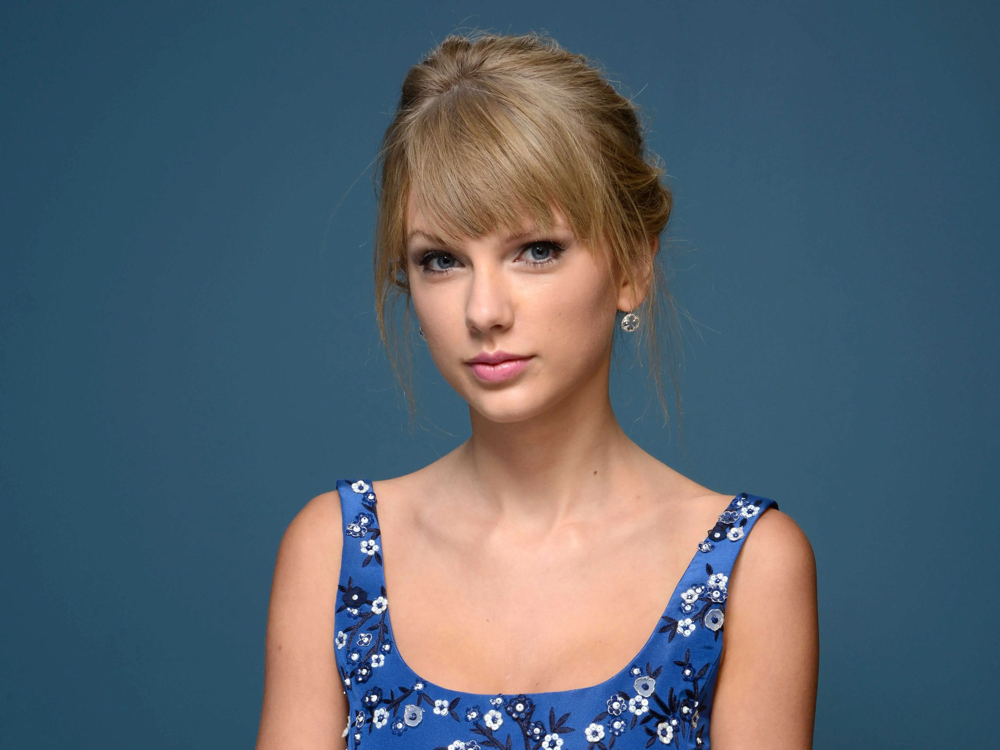
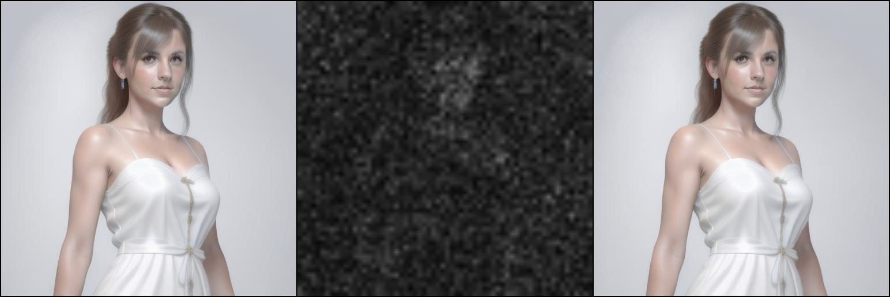
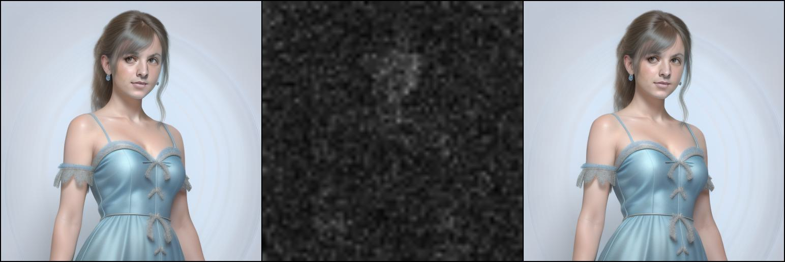

# Implementation of Score Distillation Sampling Loss with IP-Adapter

This repo is based on [IP-Adapter](https://github.com/tencent-ailab/IP-Adapter/tree/main) and [DreamFusion](https://dreamfusion3d.github.io/). Thanks for their works.

## INSTALL
Please refer to [IP-Adapter](https://github.com/tencent-ailab/IP-Adapter/tree/main) and follow their guidance. If you have any problems with this repo, welcome to add an issue.

**Notice:**
This implementation is based on the **special version** of IP-Adapter - `IP-Adapter-FaceID-PlusV2`. You can find some details through their huggingface, [link](https://huggingface.co/h94/IP-Adapter-FaceID).

## Models
Some third party models should be installed, here are the list.

**Base Model:**
[Realistic_Vision_V4.0_noVAE](https://huggingface.co/SG161222/Realistic_Vision_V4.0_noVAE)

**Face Detector and Feature Extractor**
[insightface - buffalo_l](https://github.com/deepinsight/insightface/tree/master/model_zoo)

**Image Encoder**
[CLIP-ViT-H-14-laion2B-s32B-b79K](https://huggingface.co/laion/CLIP-ViT-H-14-laion2B-s32B-b79K)

**VAE**
[sd-vae-ft-mse](https://huggingface.co/stabilityai/sd-vae-ft-mse)
Better vae model finetuned on LAION Dataset.

**IP-Adapter-FaceID-PlusV2 ckpt**
Please go to the [IP-Adapter Huggingface link](https://huggingface.co/h94/IP-Adapter-FaceID/tree/main) and download `ip-adapter-faceid-plusv2_sd15.bin
`.

**OpenPose ControlNet**
[OpenPose ControlNet](https://huggingface.co/lllyasviel/control_v11p_sd15_openpose)
Annotator and ControlNet are included in this link.

## Configs
After download all the related weights, please check the config file in `configs/guidance_config.py` carefully , change the related weight path to your own path.

## About Text to 3D/Avatar Generation
This repo is aimed to be applied on text to 3D avatar generation, we are working hard on it. If you are familiar with Score Distillation Sampling (SDS) Loss based text to 3d generation, this repo is easy for you to use. Just take the rendered image with gradient as the input, SDS loss will give the proper guidance for 3D optimization.

## About ControlNet
I don't check the code with OpenPose ControlNet, if you are interested, you can test on the `2d_playground.py`. Just change
```
guidance = StableDiffusionIPAdapterGuidance(
    device=device,
    config=config,
)
```
to
```
guidance = StableDiffusionIPAdapterGuidance(
    device=device,
    config=config,
    use_controlnet=True,
)
```
and add **OpenPose Skeleton Image Path** to `skeleton_image_path`.

## Results
Here are the test results, you can generate your own results through `2d_playground.py`.
Face ID:


Results:



